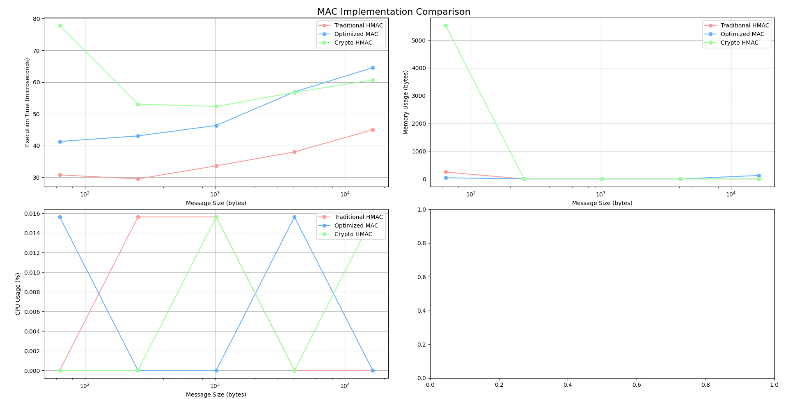

# Optimized MAC Implementation for IoT Devices

## Overview
This project evaluates and benchmarks three Message Authentication Code (MAC) implementations:

- Traditional HMAC: A straightforward implementation using Python's hmac library and SHA-256 hashing.

- Optimized MAC: A custom implementation designed for efficiency, particularly in IoT applications.

- Crypto HMAC: An implementation using the cryptography library, emphasizing security and compliance.

The goal is to identify an optimal balance between performance (execution time), memory usage, and CPU efficiency for different message sizes, especially for resource-constrained environments like IoT devices
## Features
- Traditional HMAC: Minimalistic, reliable implementation.

- Optimized MAC:

    - Precomputed keys to reduce redundant operations.

    - Caching to handle repeated message inputs efficiently.

    - Memory optimization for lightweight devices.
- Crypto HMAC: Robust and secure implementation leveraging the cryptography library.
## Results Summary
### Execution Time

- Traditional HMAC: Fastest for small messages, consistent performance.

- Optimized MAC: Slightly slower due to caching overhead but scales well.

- Crypto HMAC: Higher latency for small messages but performs competitively for larger ones.

### Memory Usage

- Optimized MAC: Most memory-efficient for small inputs, with manageable increases for large inputs.

- Traditional HMAC and Crypto HMAC: Low memory consumption, but less consistent for small inputs.

### CPU Usage

- All implementations exhibit minimal CPU usage, with minor inconsistencies due to system noise.

## Performance Evaluation

## How the Optimized MAC Works

### Key Improvements

Precomputed Keys:

- Inner and outer keys are processed during initialization, reducing computational overhead during execution.

- Caching:

    - Implements caching for repeated messages, eliminating redundant hashing operations.

- Streamlined Design:

    - Minimizes the use of intermediate objects to reduce memory usage.

These optimizations make the implementation well-suited for IoT devices with limited resources.
## Detailed Results
Benchmark Results

The benchmarking script processes messages of varying sizes (64B, 256B, 1KB, 4KB, and 16KB) and evaluates the following metrics:

- Execution Time: Measured in microseconds.

- Memory Usage: Measured in bytes.

- CPU Usage: Measured as a percentage.

Summary:

- 64 Bytes:

    - Traditional HMAC: 30.77 µs, 246B memory, 0.000% CPU

    - Optimized MAC: 41.30 µs, 41B memory, 0.016% CPU

    - Crypto HMAC: 77.85 µs, 5530B memory, 0.000% CPU

- 16KB:

    - Traditional HMAC: 45.00 µs, 0B memory, 0.000% CPU

    - Optimized MAC: 64.56 µs, 123B memory, 0.000% CPU

    - Crypto HMAC: 60.69 µs, 0B memory, 0.016% CPU
## Conclusion
### Recommendations

- Traditional HMAC: Ideal for scenarios prioritizing speed and simplicity.

- Optimized MAC: Best for resource-constrained IoT environments where memory efficiency and caching are essential.

- Crypto HMAC: Recommended for applications requiring high-security standards.
## 📜 License

This project is open-source and available under the [MIT](https://choosealicense.com/licenses/mit/)

## Contact
For questions or feedback, please reach out to:

Email: me.akiburrahman@gmail.com